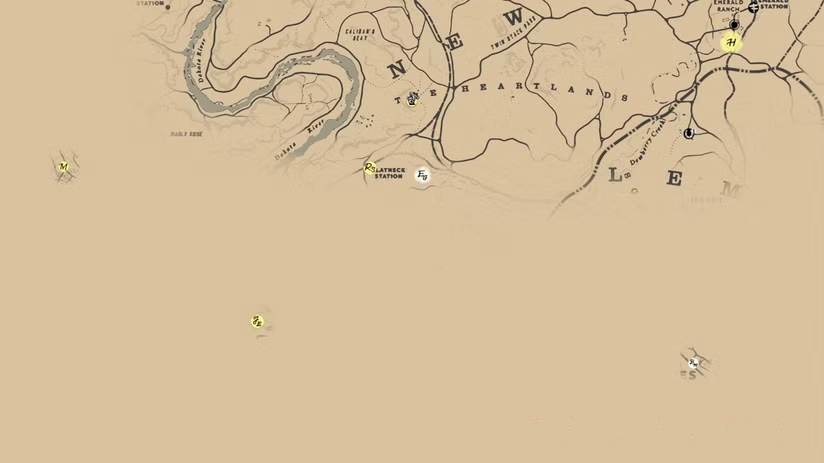

nunca fui muito bom em cumprir metas. mas sempre fui muito bom de pensar como gostaria que meu ano seguinte fosse. 

lembro bem de um ano novo em que acampei com meu pai e de madrugada, durante um temporal que alagou completamente nossas barracas, eu escrevia o que esperava de 2011 no meu surrado iPod Touch. o plano era, entre outras coisas, fazer minha primeira viagem internacional, que minha vida fosse cheia de emoções como skins e perder a virgindade. nada disso se concretizou, mas sigo firme até hoje nesse exercício de refletir sobre o ano que passou e o que eu quero construir para o que começa - com maior ou menor efetividade, ano após ano.

nos últimos anos, influenciado digitalmente por influenciadores digitais aleatórios do youtube, comecei a estruturar as coisas de uma maneira um pouco mais racional - em vez de apenas anotar grandes conquistas que eu gostaria que caíssem no meu colo (literalmente, no caso da virgindade), como pedidos para o papai noel. não que exista qualquer racionalidade em esperar mudar de vida a partir de um marco imaginário, MAS, você há de convir, existem formas e formas de estruturar essas resoluções de ano novo.

acabei chegando num sisteminha que eu acho divertido de elaborar, menos frustrante de acompanhar e que no fim do ano me leva a um percentual de cumprimento superior a 0%. se bobear, devo estar até entre os top 6 bilhões cumpridores de metas de ano novo.

mas veja, meu objetivo com esse post não é te convencer de que o meu sistema é o melhor ou te ensinar a fazer igual. tudo isso aqui é só para introduzir que eu realmente gosto de pensar em resoluções de ano novo e que neste ano eu coloquei como meta: **1\. escrever mais e publicar mais; 2. abrir publicamente as minhas metas**. 

por quê essa segunda parte? não sei, talvez com um certo grau de _publicidade_ , eu me sinta mais compelido a correr atrás delas? quem sabe. ou talvez porque eu tenha pensado, enquanto corria hoje, mais cedo (sim, também uma meta de ano novo!), na piadoca _metameta_ e ri por exatos 3 segundos antes de voltar a querer morrer? nunca saberemos.

enfim, neste ano, eu organizei metas como estas acimas, em categorias e são elas:

  * autocuidado e saúde
  * carreira e estudos
  * soberania digital
  * relacionamentos
  * lazer, bem-estar e criatividade
  * desenvolvimento pessoal e finanças

nem tudo faz taaanto sentido assim junto, mas foi mais fácil agrupar de alguma forma devido a estrutura que eu adotei. explico: **cada categoria tem uma meta-síntese** (omg JK hiii) e objetivos menores. algumas dessas meta-sínteses tem prazo, outras não, mas em comum **todas tem um prêmio** **quando alcançá-las**. por exemplo, em autocuidado e saúde são:
    
    
    ⛳ **meta-síntese** : terminar o primeiro semestre correndo 10km OU pedalando muito/escalando muito/jogando muito/etc 
    🏆**prêmio** : um novo tênis de corrida OU acessório para esse novo esporte

não tem jeito, o pai tá ficando velho e tem que começar a se cuidar melhor pra não ficar com a barriguinha de chopp legada pela linhagem paterna. abaixo da meta-síntese, vêm os demais objetivos da categoria:

**[ ]** começar um **esporte/atividade coletiva** (volei, escalada, pedal, teatro, etc.)  
**[ ]** ir em frente com o **diagnóstico de TDAH**   
**[ ]** ir num dermatologista e melhorar meus **cuidados com a pele**  
**[ ]** 1 mês de teste “**celular dorme fora do quarto** ”

e para a categoria como um todo, existem também mais duas sessões: **hábitos para chegar lá** e **tracking** , auto-explicativos. para o primeiro grupo, temos os seguintes hábitos:

  * manter uma rotina de treino ABCD (pelo menos 4x por semana, 200x no ano) + pelo menos 30 min de cardio, 2x por semana.
  * me programar fazer pelo menos 12 cardios intensos no ano. passeios de bike (>15km), fazer uma corrida de 10km, uma trilha >5km, etc.
  * skin care todos os dias - hidratante, acido retinoico e guasha.

essa estrutura, em relação ao ano passado, tem como diferença apenas a meta-síntese e os prêmios (uma estratégia para condicionar compras maiores à realizações pessoais, fui muito gastador em 25). esse sistema funcionou razoavelmente bem, ano passado, principalmente por que, além de metas + hábitos, criei uma rotina (com direito a lembrete no celular) para começar cada segunda-feira revendo minha _quest_ trimestral - onde pinçava algumas metas para serem priorizadas.

meu notion fica mais ou menos assim

seguindo, em **Carreira e Estudos** também não teve jeito, terei que me render a xepa do engajamento do CLT e começar a me posicionar melhor no LinkedIn. eu sei, acredite, EU. SEI., mas preciso começar fazer as coisas andarem mais rápido e me destacar no mercado de trabalho para bancar os prêmios de todas as metas que irei alcançar. essa é a minha meta-síntese e como prêmio estou entre algum curso foda na minha área profissional ou um intercâmbio para aprimorar o meu inglês (com que dinheiro? depois vejo isso).

além disso, 2025 me deu uma grata surpresa que foi fazer as pazes com a academia (a dos livros, não a de puxar ferro). me matriculei como aluno especial na pós-graduação em comunicação da UnB e por 1 semestre ir para a aula foi uma dos melhores momentos da minha semana. chocante, eu sei. em 2026, então, quero testar mais fundo essas águas. tô pensando em metas como aluno especial novamente ou me juntar a algum grupo de pesquisa e se, e apenas se as coisas fluírem legal me candidatar ao mestrado no segundo semestre. creio que não serei aprovado de primeira, mas o projeto já terá começado a ganhar forma.

já **Soberania digital** é uma categoria nova entre as minhas metas e é, na minha opinião, a mais interessante. aqui, eu penso por um viés tanto de ser menos dependente da tecnologia, como também de depender menos de empresas malignas. vem de uma percepção que muito do cansaço que sinto não vem do trabalho, mas sim da forma como a tecnologia ocupa cada fresta das nossas vidas.

eu não gosto de passar tanto tempo no meu celular, odeio tudo que eu deixo de fazer porque fiquei distraído em redes sociais e gosto menos ainda de fazer isso enquanto dou dinheiro para Google, Meta, Amazon e cia. então quero, não me libertar totalmente, mas me tornar mais autônomo nas duas frentes e utilizar com mais _intenção_.
    
    
    **⛳ meta-síntese:** reduzir uso **automático** do celular, mesmo que o tempo total não caia tanto no início. meta: menos de 5h/dia. 
    🏆**prêmio** : um HD de 8 TB para o servidor doméstico.

além disso, esse grupo tem outros objetivos nessa linha, como adotar um ritual matinal que não comece pelo celular e estabelecer limites no uso (como refeições, horário de trabalho, etc.). os outros objetivos são mais na linha reduzir a dependência de big techs:

**[ ]** **avançar em direção ao degoogling**. estabelecer minha própria nuvem com backup de fotos, abandonar o Gmail, reduzir uso das buscas do google e cancelar Google One. [**nota** : penso até em escrever um post sobre o assunto, compartilhando meu projeto conforme eu for avançando e testando cada solução.]  
**[ ]** organizar meus arquivos em todos os HDs de uma maneira lógica e racional e adotar um protocolo de backup  
**[ ]** passar a auto-hospedar este blog que você está lendo, assim como algum LLM

nessa brincadeira, eu devo economizar uns 300 reais por ano, ganhar privacidade e contribuir um pouco menos para os planos de dominação mundial dessa laia de bilionários. só vantagens, né?

a categoria seguinte é **Relacionamentos**. a ideia é me dedicar nas relações com outras pessoas tanto como em outras atividades. imagino que para algumas pessoas pode parecer meio bobo, mas para mim é importante. tenho muita dificuldade em manter contato na era do WhatsApp (sim, sou daquelas pessoas que não respondem direito, mas juro que não é por mal) e, além dessa dificuldade em conservar as amizades, não sou nada bom em conhecer novas pessoas.

some-se a isso o fato de eu trabalhar de casa em uma cidade nova &, não obstante, famosa pelas pessoas fechadas - toda semana tem um post no r/Brasília perguntando como fazer amizades aqui, rs. não uso isso como muleta, essas minhas questões vem de bem antes e, além disso, eu tive a sorte de conhecer muita gente legal em brasília, mas preciso **melhorar**. tenho como objetivos convidar pessoas novas para sair e transformar conhecidos que admiro em amigos. 

e, numa outra linha, **aprender a ter conversar difíceis, honestas** \- estou precisando ter algumas - e criar, testar e botar em prática rituais divertidos em casal. o prêmio da meta-síntese not disclosed: uma viagem especial.

em 2026, eu também quero ser uma pessoa mais criativa. eu nunca fui BOM nisso (as in fazer coisas belas, esteticamente aprazíveis), mas eu já criei muito. era uma criança e adolescente que adorava criar - de fanfic (antes de saber que isso existia) a jogos com o RPG Maker - e quero que isso volte a fazer parte da minha vida. quero deixar de ser mero consumidor e me tornar um criador, sem qualquer pretensão de ganho, atenção ou qualquer coisa. para mim mesmo.

por isso pensei na categoria **lazer, bem-estar e criatividade** , que tem como norte:
    
    
    ⛳**meta-síntese** : realizar pelo menos um projeto criativo por mês. pode ser escrever e publicar um texto, produzir uma música, uma série de fotografias, vídeo-ensaio, etc. 
    🏆 **prêmio** : me dar uma controladora MIDI ou câmera bacana no fim do ano

para dar uma direção, pensei em alguns objetivos secundários que podem também ser considerados nesta meta global. por exemplo:

**[ ]** começar um journal de colagens  
**[ ]** organizar minha produção fotográfica de alguma forma. montar uma galeria/portfolio no meu blog, maybe?  
**[ ]** tirar fotos analógicas e revelá-las  
**[ ]** escolher algum tema criativo e me dedicar com profundidade por alguns meses, por conta própria. estudar, mas também praticar  
**[ ]** fazer algum curso presencial de artes. teatro, produção musical, dança, escrita criativa, etc.

e, para fechar, temos o grupo **desenvolvimento pessoal e finanças**. neste ano muito mais o último que o primeiro, mas talvez eu inclua mais alguma coisa aqui mais pra frente. 
    
    
    **⛳ meta-síntese** : juntar dinheiro para dar entrada em um apartamento. 
    **🏠 prêmio** : comprar um apartamento!

é isto. quero sair do aluguel, mas para isso preciso dar uma entrada polpuda para que as prestações não me sufoquem.

atualmente eu não consigo guardar muito dinheiro. na real, o único dinheiro que guardo são os extras - PLR, 13º e coisas assim. pretendo mudar isso e começar a juntar **pelo menos 10% do meu salário** todo mês e, se não receber PLR esse ano (o que é muito provável) segurar as pontas e começar a guardar 20%. também espero reduzir gastos recorrentes, como assinaturas: Google One e Hostinger são dois que já tem data de validade, mas pretendo descobrir outras torneiras que eu possa fechar.

para ajudar nisso, tenho um outro objetivo de organizar meus gastos. não sei se tenho paciência para planilha financeira, mas quero descobrir alguma estratégia que funcione com esforço mínimo. e, para justificar o desenvolvimento pessoal no título, tem também a meta de **ler pelo menos 12 livros no ano**. não é tanto, mas é o que eu posso e eu tenho que sustentar outras leituras (como as acadêmicas) ao longo do ano e tem também a coisa de criar-mais-consumir-melhor.

✷

estes não são objetivos para ser _Mais Produtivo_ em 2026. 

é, pelo contrário, uma espécie de mapa impreciso, inexato. como um ponto numa área ainda não explorada em um jogo de mundo aberto. daqueles que você tem que chegar, mas não sabe como irá e muito menos como é a vizinhança do destino final. mas pelo menos sabe em qual direção caminhar.

talvez eu cumpra metade desses objetivos. talvez mude tudo no meio do caminho. talvez o mundo acaba antes do fim do ano. mas como uma profecia autorrealizável, escrever isso ao primeiro de janeiro já mudou meu 2026.