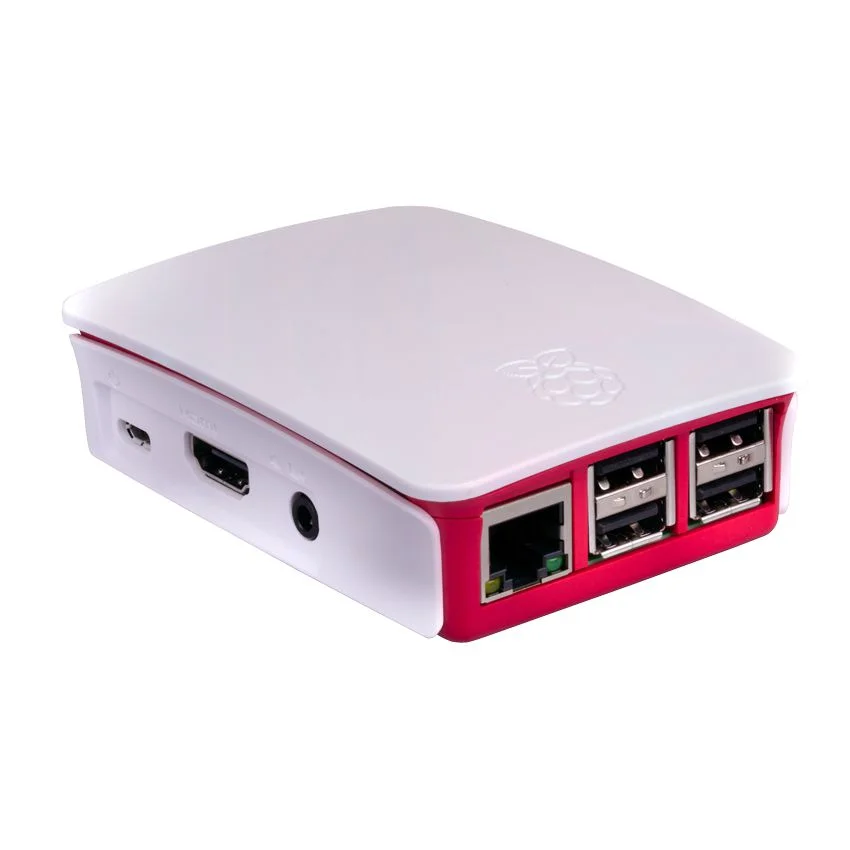
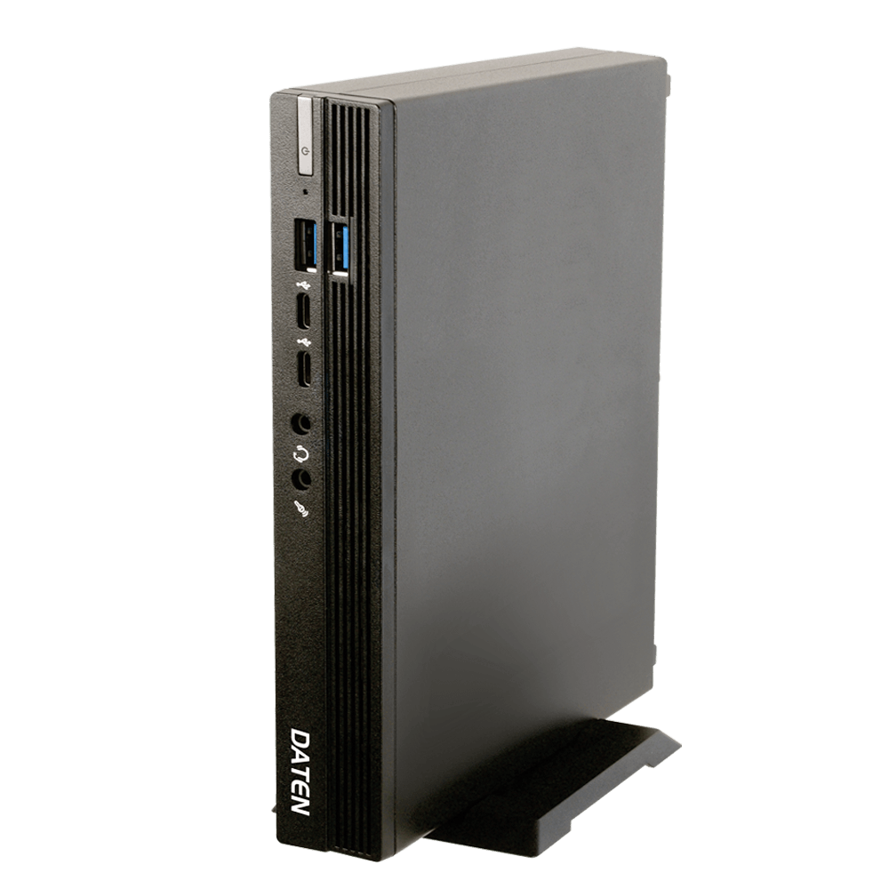
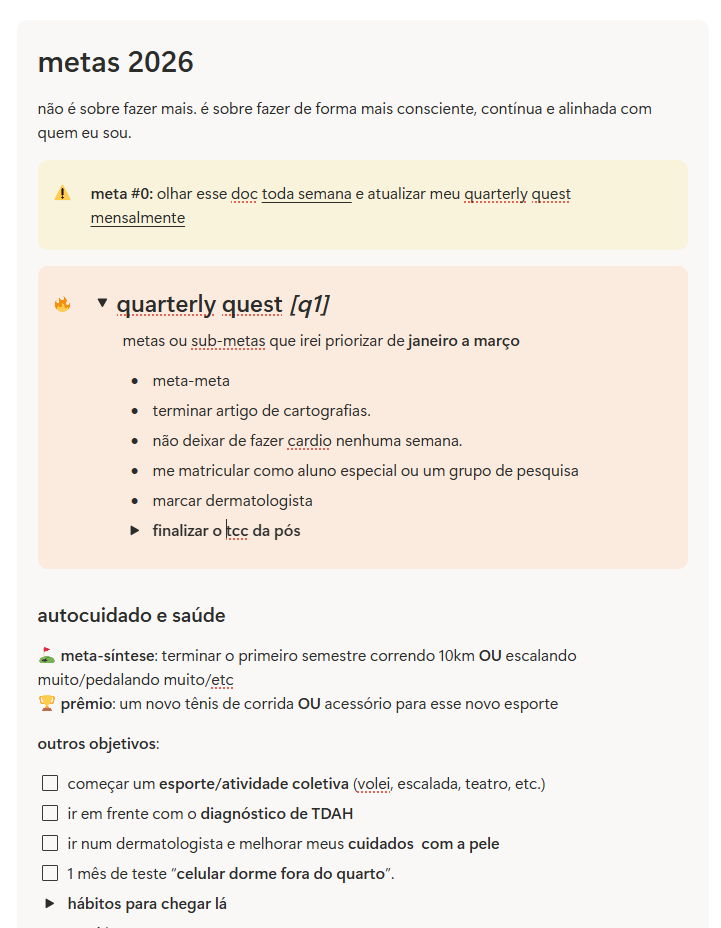
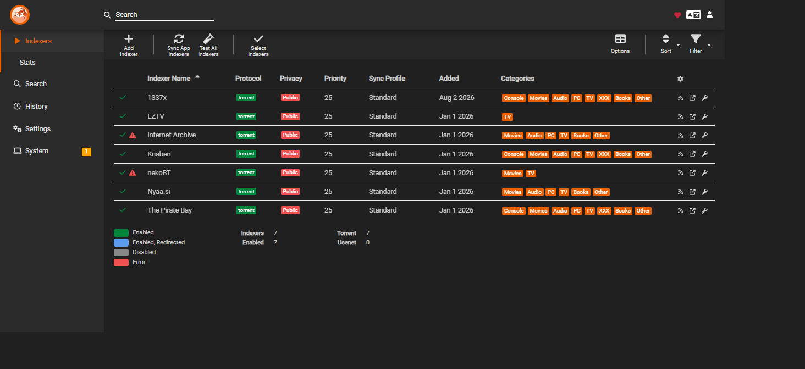

Se você que está lendo é um leigo, pode estar se perguntando: “por que eu iria querer um servidor!? Isso deve ser muito complicado.” Já se você não é tão leigo assim, deve estar pensando: “para quê eu iria querer ter esse trabalho todo!?”

Para ambos a minha resposta seria: eu sou um leigo e nem tenho tanto tempo livre assim, mas ter um servidor doméstico - ou *home lab* , como os mais cool chamam - é MUITO divertido, atualmente pode ser relativamente fácil e barato, e ainda abre um mundo de possibilidades para fazer várias coisas legais.

Algumas das minhas funcionalidades favoritas são:

* um serviço de **gerenciamento de biblioteca filmes e séries** que baixa, procura uma legenda, sincroniza e organiza toda minha biblioteca.
* não só isso, minha biblioteca **monitora minha watchlist do letterboxd** e automaticamente baixa os filmes que quero ver.
* tudo isso é disponibilizado num **streaming privado com os meus filmes, séries e músicas** para assistir em qualquer dispositivo, sem depender de decisões malucas de executivos em Hollywood.
* um **ad-blocker que bloqueia os anúncios em todos os dispositivos conectados no meu wi-fi**, incluindo YouTube na TV, por exemplo.
* uma solução de **backup de fotos tipo o Google Photos** , só que sob o meu controle e sem mensalidade.

E muito, muito mais.

Além disso, todo esse experimento me ensinou um monte sobre Linux, terminal, containers docker e sobre como construir soluções de acordo com as minhas necessidades - em vez de adequar meus desejos às soluções de mercado. Traz, novamente, aquela sensação de ter 14 anos e ter que desbravar a internet tentando consertar alguma cagada que você fez alterando configurações do sistema, sabe? \[sensação que só os 30+ devem se identificar]

Enfim, a ideia deste texto é, além de compartilhar o conhecimento e criar novos adeptos, documentar o passo a passo do que eu fiz, conforme eu vou evoluindo meu setup. Então esse post deve ser atualizado com alguma regularidade com as últimas novidades do meu server.

## o hardware

O bom dessa brincadeira é que ela é muito pouco exigente com o hardware.

Eu já mantive um servidor bem poderoso com apenas um Raspberry Pi 3. Para quem não conhece, esse é um computador do tamanho de um cartão de crédito com capacidades bastante limitadas. **Também é possível usar um computador ou notebook velho**.



Claro, um hardware mais básico pode acabar limitando um pouco as possibilidades do que você pode fazer com o home server. Contudo, é meio surpreendente o quão otimizados são os softwares normalmente utilizados para esse fim. Sempre vale o teste.

Na encarnação atual, meu servidor funciona em um miniPC Daten, que foi comprado de segunda mão da empresa onde minha namorada trabalha. Ele é um Core i3, com 8GB de RAM e um SSD de 256GB. Isso é mais do que o suficiente para tudo o que eu já me propus a fazer até hoje. 

Na *arquitetura* , esse miniPC é como os computadores que usamos no dia a dia - ao contrário do *RasPi* que, sendo um ARM, está mais próximo de um celular, por assim dizer. Sua configuração é mais do que razoável para as aplicações que pensei.



Esse tipo de servidor, normalmente, não vai precisar de monitor, mouse ou teclado na maior parte do tempo. Na real, você só vai usar isso nos primeiros minutos mesmo. A partir daí, quase tudo será feito através do navegador, de outro computador com acesso a mesma rede ou de um celular mesmo. Aqui em casa ele fica no alto da estante, do ladinho do roteador, ao qual está plugado com um cabo de rede para garantir uma conexão mais veloz.

Isso, se você quiser um servidor dedicado a função e/ou ligado 24/7. Caso prefira, também pode **rodar quase tudo isso em um computador com o Windows** mesmo. O passo a passo vai ser **bem diferente** (não vai ser necessário instalar o Ubuntu e o CasaOS, e a instalação dos add-ons não vai ser a partir da app store deste último), mas é perfeitamente possível e funcional.

Além disso, aqui em casa eu incluí ao meu setup um [no-break](https://www.amazon.com.br/Nobreak-PREDATOR-Bivolt-Ragtech-4570/dp/B0BG6GD4L7/ref=asc_df_B0BG6GD4L7?mcid=04ff363e98143b27b875513aedfbe327&tag=googleshopp00-20&linkCode=df0&hvadid=709884703642&hvpos=&hvnetw=g&hvrand=10006807900300635057&hvpone=&hvptwo=&hvqmt=&hvdev=c&hvdvcmdl=&hvlocint=&hvlocphy=9257517&hvtargid=pla-1930012292795&psc=1&hvocijid=10006807900300635057-B0BG6GD4L7-&hvexpln=0&language=pt_BR). HDs não gostam de serem desligados inesperadamente e, como eu fiz do meu servidor um backup das minhas fotos, todo cuidado é pouco. 

## o software

No passado, com o RaspberryPi, minha stack era basicamente o LibreELEC como sistema operacional + add-ons do Kodi que faziam todo o trabalho sujo. Cheguei a testar o RetroPie, OpenMediaVault e algumas outras distros, mas o LibreELEC me ganhou por se mostrar mais prático e estável.

Desde que meu novo miniPC chegou eu testei o Umbrel, mas **decidi ficar, no final, com o CasaOS**.

O Umbrel é lindo, facílimo de instalar e de acrescentar add-ons, mas tem um grande problema: não suporta armazenamento externo, o que me limitaria ao SSD interno. Quem me conhece sabe que eu sou meio que um acumulador digital ~~(e analógico)~~, então seria insuficiente para mim.

Pode ser que o Umbrel, um dia, suspenda essa restrição. Nesse momento, posso voltar a testá-lo, mas hoje, a melhor opção que encontrei é o CasaOS. Ele não é tão fácil de instalar e um pouco menos bonito, mas, uma vez instalado, também é super prático de evoluir e manter.

O motivo de mencionar o nome de tantos softwares aqui não é confundir, mas sim de mostrar que **existe um rico ecossistema e comunidades ao redor desses bichinhos. Para cada especificidade existe uma distro, fork ou plugin.** Caso minhas sugestões não atendam totalmente as suas necessidades ou limitações, com certeza uma pesquisa no Google pode revelar novas opções!

## instalando o Ubuntu

Antes de colocar o CasaOS para rodar, precisamos de um sistema operacional base. A recomendação oficial é usar o Debian ou o **Ubuntu Server 20.04 LTS**, que foi a minha escolha. Ele é leve, estável e muito bem documentado — o que é ótimo para quem está começando.

Segui esse [tutorial do Diolinux](https://diolinux.com.br/tutoriais/casa-os-o-linux-para-casas-inteligentes.html), que também tem vários outros conteúdos ótimos sobre Linux e CasaOS no seu site e canal do YouTube.

Em resumo, para instalar o Ubuntu no seu servidor, você vai precisar de:

* um pendrive com pelo menos **4GB**
* um computador funcional (pode ser o seu principal, com o Windows mesmo) para baixar e preparar o instalador
* baixar a [imagem oficial do Ubuntu Server no site oficial](https://ubuntu.com/download/server)
* baixar o [Balena Etcher](https://www.balena.io/etcher/) que transformará o pendrive em um instalador do Ubuntu.

### passo 1: criando o pendrive de instalação

Depois de baixar a imagem do Ubuntu, você precisa gravá-la no pendrive. Para isso, abra o Balena Etcher, selecione o arquivo `.iso`, escolha o pendrive e clique em "Flash!". Em alguns minutos, seu pendrive estará pronto.

Caso o Balena Etcher não funcione, tente o Rufus. Ele não é tão simples quanto o primeiro, mas foi a minha opção por aqui.

### passo 2: fazendo o boot com o pendrive

Agora que seu pendrive está pronto, é hora de colocá-lo no seu servidor, conectar teclado, mouse e monitor e ligar a máquina. Provavelmente será necessário apertar alguma tecla tipo **F12** , **Del** ou **Esc** na hora de ligar para acessar o menu de boot e selecionar o pendrive.

Caso você esteja confuso com isso, basicamente, precisamos dizer para o computador que, em vez de usar o HD, ele deve ligar usando o pendrive. Cada máquina é de um jeito, infelizmente, mas se não estiver seguro sobre o que está fazendo, jogue o fabricante + modelo do seu computador + boot no Google.

### passo 3: instalando o Ubuntu

Ao iniciar, o instalador do Ubuntu vai mostrar uma tela preta com um menu. Basta seguir os passos da instalação padrão:

* **Escolha o idioma e layout do teclado** (pode deixar português ou inglês, como preferir, mas se estiver usando um teclado com a tecla Ç selecione o teclado ABNT2)
* Na parte de rede, certifique-se de que seu **dispositivo está conectado ao roteador via cabo** , para evitar problemas com driver wireless. A opção DHCP selecionada vai selecionar um endereço IP automaticamente.
* Quando perguntar sobre **particionamento do disco** , escolha a opção que convir. No meu caso, optei por usar o disco inteiro, mas atenção: isso APAGA tudo o que estiver no HD da máquina, garanta que você fez backup se selecionar o mesmo.
* Crie um **usuário e senha dos quais irá se lembrar** (vai precisar deles sempre)
* **Instale o OpenSSH** quando for perguntado — isso permite que você acesse seu servidor remotamente depois, sem monitor

Sistemas operacionais Linux não são dos mais intuitivos. Portanto, se estiver na dúvida, procure algum tutorial de instalação do Ubuntu Server 20.04 LTS ou a distro de sua escolha e siga-o passo a passo.

Quando a instalação terminar, remova o pendrive e reinicie o servidor.

Pronto! A parte mais chata já foi.

## primeiros passos com o CasaOS

Ao final da instalação do Ubuntu ele irá exibir na tela o endereço IP do seu servidor. Algo como **192.168.0.1.** Anote esse número, ele será importante.

O Ubuntu Server é um sistema operacional sem interface gráfica. Isso significa que essa tela preta que você vê após a instalação é o sistema mesmo. Não tem menu, janelas ou outras telas. Doideira, né?

Felizmente, a única coisa que faremos aqui é instalar o CasaOS. Ele sim com uma interface gráfica simplificada, intuitiva e com tudo o que a gente precisa.

Isso é feito através de comandos executados nessa tela preta, que é chamada de terminal. Você deve digitar nele:

curl -fsSL <https://get.casaos.io> | sudo bash

Por via das dúvidas, confirme no [site oficial do CasaOS](https://casaos.zimaspace.com) qual o comando atual para instalação (conforme imagem abaixo).


Agora começa a parte divertida!

### acessando o CasaOS

Com o Ubuntu Server instalado com sucesso e o CasaOS rodando, você pode guardar teclado, mouse e monitor. A partir daqui, vamos fazer tudo do seu computador principal (recomendado) ou celular.

Lembra do IP do servidor, que você anotou agora há pouco? Basta abrir o navegador da sua preferência e digitar aqueles números para acessar o CasaOS. Um detalhe importante é que o seu outro dispositivo e o servidor precisam estar conectados na mesma rede.

Apesar de ser possível fazer tudo com um celular. recomendo fortemente o uso de um computador para fazer os próximos passos. Pode ser coisa de millennial, mas a telinha do celular dificulta um pouco as coisas. 

**Crie seu usuário e senha, e pronto:** você já tem um painel bonito, com loja de apps, gerenciador de arquivos, e tudo o que precisa para começar a transformar seu servidor numa central multimídia poderosa.

Você deverá ver algo semelhante a isso:



## configurações iniciais recomendadas

Depois que o CasaOS estiver no ar e você conseguir acessar a interface pelo navegador, tem algumas coisinhas que eu recomendo configurar antes de sair instalando app a torto e a direito:

### 1. Atualize o CasaOS

Na parte superior esquerda da tela, clique no ícone do meio, que representa alguns controles, e depois vá em **Atualizar**. Provavelmente nada acontecerá, mas se houver uma versão nova pode corrigir bugs ou melhorar a performance geral do sistema.

### 3. Monte seu armazenamento

Se você pretende usar um HD externo ou pendrive como armazenamento, agora é uma boa hora de inseri-lo no servidor.

Se tudo tiver certo, ele aparecerá automaticamente no app Files (na lateral esquerda, após abrir o app, você encontrará todos os dispositivos de armazenamento montados). Caso contrário, pode ser necessário montá-lo manualmente. Infelizmente, o Linux tem dessas.

É um processo chatinho, mas rápido. Como eu não tenho propriedade para falar do assunto, minha sugestão é que você busque algum tutorial no Google (tem vários específicos para o CasaOS) ou peça ajuda ao ChatGPT - com um bom prompt, ele costuma ser bem útil na hora de resolver problemas que exijam operar o terminal.

Ao final do processo, caso você não esteja habituado ao sistema de arquivos do Linux, vale clicar com o botão direito sobre alguma pasta no seu HD externo. Copie o caminho e observe o endereço. Deve ser algo como "**/media/devmon/hdexterno** ". Esse será o caminho que você usará para indicar onde estão seus downloads ou arquivos nos apps.

## instalando apps úteis no CasaOS

Com tudo configurado, é hora de turbinar seu servidor.

O CasaOS tem uma **App Store própria** , mas você também pode instalar apps manualmente de diferentes formas. Aqui, vou focar na maneira mais simples, usando a loja.


### instalando o repositório [LinuxServer.io](http://linuxserver.io/) no CasaOS

Na minha experiência, os apps disponíveis no repositório [LinuxServer.io](http://LinuxServer.io) funcionaram melhor (e frequentemente estão mais atualizados) do que os mesmos apps baixados da loja padrão. Então, antes, vamos acrescentar essa nova fonte de apps ao CasaOS.

1. **Abra o painel do CasaOS** no navegador (o IP do seu servidor).
2. Vá até a **App Store** e clique no botão **“Add Source”** (fica no canto direito, logo acima da lista de apps).
3. Cole esse link no campo que aparecer: 
4. Clique em **“Add”** para confirmar.

Pronto! Agora o CasaOS vai baixar e adicionar essa nova fonte de apps. Quando terminar, você verá várias novas opções na sua loja, incluindo meus queridinhos de automação de mídia.

Além dessa, existem várias outras fontes de apps. Clique aqui para ver uma lista com todos os [repositórios reconhecidos oficialmente pela equipe do CasaOS](https://awesome.casaos.io/content/3rd-party-app-stores/list.html).

Agora é uma boa hora para explorar e baixar apps aleatórios da loja como se tivesse de celular novo.

## montando seu streaming caseiro automatizado com o CasaOS

Com o CasaOS rodando lindamente, chegou a hora de transformar o servidor numa central de entretenimento automatizada. A ideia aqui é simples: você adiciona o nome de um filme ou série e o servidor cuida do resto. Ele procura, baixa, organiza, coloca legenda e deixa tudo prontinho pra assistir. Só dar play.

Kudos para o redditor lolado06, que publicou esse [ótimo tutorial no r/pirataria](http://reddit.com/r/pirataria/comments/18ch7bt/guia_do_streaming_doméstico_automatizado_sonarr/) e serviu de guia da minha instalação.

### os aplicativos envolvidos

Aqui vai um resumo do que cada app faz, pra você entender como eles se conectam:

* **Transmission** : o cliente de torrent que vai baixar os arquivos. O Radarr e o Sonarr mandam os pedidos pra ele. O qBitTorrent costuma ser o mais recomendado, mas por força do hábito sigo com o Transmission.
* **Radarr** : gerencia os filmes. Você adiciona um título, ele procura automaticamente e baixa.
* **Sonarr** : faz o mesmo, mas com séries. Funciona até com episódios semanais.
* **Prowlarr** : serve como "ponte" entre os apps e os sites de torrent. É ele que permite que o Radarr e o Sonarr encontrem conteúdo nos sites certos.
* **Bazarr** : cuida das legendas. Busca e sincroniza automaticamente para filmes e séries.
* **Emby** ou **Jellyfin**: é o seu streaming pessoal. Interface bonitinha, apps para TV, celular, navegador... tudo sob seu controle.

Parece muita coisa e realmente exige um tempinho para configurar tudo. Mas depois de configurado uma vez, a manutenção é mínima e você pode esquecê-lo por meses, juro!

### estrutura de pastas e volumes

Antes de configurar os apps, crie as seguintes pastas no seu armazenamento (de preferência num disco com bastante espaço):

* `/media/devmon/`hdexterno`/downloads` (downloads brutos) e dentro dessa pasta, outras duas pastas, complete e incomplete.
* /media/devmon/`hdexterno`/`filmes` (filmes organizados)
* /media/devmon/`hdexterno`/`series` (séries organizadas)
* e por aí vai, de acordo com as suas necessidades. Pode ter música, livro, fotos, etc.

Essas pastas vão ser usadas por todos os programas.

Outra configuraçãozinha chata que é necessária nesse processo é dar acesso à essas pastas a cada um dos apps. Não vou entrar nos detalhes técnicos, mas por padrão os apps instalados via CasaOS (que rodam dentro de containers Docker) não têm acesso direto a qualquer pasta do seu sistema. Para mudar isso:

1. Na tela inicial do CasaOS, clique nos 3 pontinhos e depois no botão de **Configurações (⚙️)** do app que você quer configurar (por exemplo, o Radarr).
2. Na aba **Volumes** , clique em **Adicionar Volume**.
3. Em **Caminho do host** , digite o caminho da pasta que você quer disponibilizar, como `/mnt/hdexterno/Filmes`.
4. Em **Caminho no contêiner** , defina um caminho, como `/movies`.
5. Salve. O container será reiniciado e deverá estar disponível novamente em alguns segundos.


Repita isso para cada app que precise acessar uma pasta específica. Mais ou menos assim:

* Radarr: ```/media/devmon/`hdexterno`/`filmes`` → `/movies` e```/media/devmon/`hdexterno`/`downloads → `/downloads`
* Sonarr: ``/media/devmon/`hdexterno`/``series → `/`shows e ``/media/devmon/`hdexterno`/``downloads → `/downloads`
* Transmission: ``/media/devmon/`hdexterno`/``downloads → `/downloads`
* Emby: todas as pastas de mídia que forem usadas como biblioteca (filmes, series, musicas, etc.; downloads não)

Depois disso, nas configurações internas dos apps, vamos apontar para o caminho dentro do contêiner (por exemplo, `/movies`) e não o caminho completo do host (```/media/devmon/`hdexterno`/`filmes``).

## torrents com o Transmission

* Instale o Transmission via app store.
* **Libere o acesse a pasta downloads conforme passo a passo acima.**
* Acesse via navegador: `http://SEU_IP:9091`
* Nas preferências:

  * Em **Download to** , defina a pasta ``/media/devmon/`hdexterno`/``downloads/complete
  * Ative a opção de pasta temporária e aponte a pasta `/media/devmon/hdexterno/`downloads/incomplete.
  * Ative a opção de iniciar os torrents automaticamente
  * Adicionalmente, costumo colocar um **limite de velocidade durante parte do dia**. Como ele está conectado diretamente ao roteador, pode roubar uma fatia significativa da minha banda. Por isso, coloco um limite de 5 MB/s (um pouco menos de 10% dos meus 500 Mbps) das 7 da manhã a 00h. Assim, não impacto em nada os outros dispotivos.

## baixando e organizando filmes com o Radarr

Para gerenciar nossos filmes, vamos usar o Radarr. Ele faz parte da suíte ARR, um ecossistema de softwares de mídia open source e que conversam entre si de maneira simplificada.

Ele serve não só para baixar novas obras, mas também para catalogar o que já temos baixado e desorganizado. Outra funcionalidade que eu adoro também é a automação de download de filmes a partir de listas. Logo chegaremos lá.

Para começar:

* Instale via App Store ou Docker.
* **Libere o acesse a pasta downloads conforme passo a passo acima.**
* Acesse: `http://SEU_IP:7878`
* Se preferir, pode alterar o idioma em Settings > UI.

Se você já tem alguns filmes baixados, pode ser uma boa ideia movê-los todos para a pasta downloads. Assim, o Radarr pensará que eles acabaram de ser baixdos e irá movê-los e organizá-los na sua pasta filmes, de acordo com o padrão de nomenclatura que for definido.

### Media Management

Aqui é onde se define como os filmes serão organizados. Para mais detalhes, sugiro consultar o [passo a passo do r/Pirataria](https://www.reddit.com/r/pirataria/comments/18ch7bt/guia_do_streaming_doméstico_automatizado_sonarr/) no qual me baseei.

* Ative a renomeação de arquivos.
* Use o seguinte formato de nome de arquivo (opcional, mas é como gosto de usar): `{Movie CleanTitle} ({Release Year})`
* Adicione a pasta raiz: `/movies`

### Quality + Profiles

Podemos personalizar a qualidade dos filmes que serão baixados. Eu sugiro fortemente bloquear filmes em 3D e BR-Disk, que são extremamente pesados e vão lotar seu HD num piscar de olhos.

Para mais detalhes, sugiro consultar o [passo a passo do r/Pirataria](https://www.reddit.com/r/pirataria/comments/18ch7bt/guia_do_streaming_doméstico_automatizado_sonarr/).

### Download Client

Precisamos indicar para o Raddar que os downloadas serão feitos via Transmission. Acesse a aba Download Cliente e adicione o Transmission, inserindo a `http://localhost:9091/transmission/rpc e l`ogin e senha, se configurados.

### Listas

Uma das minhas partes favoritas é a automação que **baixa automaticamente filmes que entram na minha watchlist do Letterboxd**. Além dessa lista, é possível fazer o mesmo com praticamente qualquer coisa do Letterboxd (de listas comuns, de qualquer usuário, a filmografias completas de um artista), listas do IMDb, Trakt ou outros sites.

Basta converter uma lista para RSS com ferramentas como [`letterboxd-list-radarr.onrender.com`](https://letterboxd-list-radarr.onrender.com).

- - -

## configurando o Sonarr

Sonarr é a solução ARR para séries. Depois de primeiro, a configuração dos seguintes fica mais intuitiva e segue mais ou menos o mesmo roteiro.

* Instale e acesse via `http://SEU_IP:8989 (cada um dos apps tem a sua porta específica)`
* Altere o idioma da interface para PT-BR
* Configure Media Management e adicione a pasta raiz `/tv`
* Ajuste os perfis de qualidade e idioma da mesma forma que no Radarr
* Configure o Transmission como cliente de download

Para mais detalhes, sugiro consultar o passo a passo do r/Pirataria.

- - -

## adicionando os indexadores com o Prowlarr

O Prowlarr é quem faz a ponte entre o Radarr/Sonarr e os sites onde eles vão procurar os torrents. A grande vantagem é que você configura os indexadores **uma única vez** nele e o Prowlarr se encarrega de sincronizá-los automaticamente com os outros aplicativos.

* Instale o **Prowlarr** pela App Store e acesse pelo navegador em `http://SEU_IP:9696`.
* Vá até **Indexers > Add Indexer** e pesquise os indexadores que deseja utilizar, tem alguns mais específicos e outros que tem de tudo. Existem opções públicas e privadas, estas últimas normalmente exigem uma conta, API Key ou outras credenciais. Aqui, uso somente indexadores públicos e minha única dificuldade é encontrar filmes brasileiros mais antigos.
* Adicione os indexadores desejados e use o botão **Test** para verificar se estão funcionando antes de salvar.



Agora precisamos conectar o Prowlarr ao Radarr e ao Sonarr:

* Vá em **Settings > Apps**.
* Clique no botão **+** e escolha **Radarr**.
* Dê um nome qualquer à conexão.
* Em **Prowlarr Server**, informe `http://SEU_IP:9696`.
* Em **Radarr Server**, informe `http://SEU_IP:7878`.
* Copie a **API Key** disponível em `Settings > General` no Radarr e cole no Prowlarr (já deixe essas chaves num bloco de notas pois iremos usá-las novamente).
* Clique em **Test** e, se estiver tudo certo, salve.
* Repita o processo para o **Sonarr**, usando `http://SEU_IP:8989` e a API Key dele.

Eu deixo o **Sync Level** como `Full Sync`. Assim, sempre que você adicionar, remover ou alterar um indexador no Prowlarr, essas mudanças serão automaticamente replicadas para o Radarr e Sonarr.

Se tudo deu certo, ao abrir **Settings > Indexers** no Radarr ou Sonarr você deverá encontrar os indexadores cadastrados pelo Prowlarr por lá, normalmente identificados com `(Prowlarr)` no nome.

A partir daí, você praticamente pode esquecer essa configuração. Quando o Radarr ou Sonarr procurar alguma coisa, eles consultarão automaticamente os indexadores gerenciados pelo Prowlarr.

> **Opcional: FlareSolverr.** Alguns indexadores usam proteções do Cloudflare que podem impedir o acesso automatizado pelo Prowlarr. Nesses casos, o **FlareSolverr** funciona como um intermediário, usando um navegador automatizado para contornar esse bloqueio. Ele não é necessário para todos os indexadores, então só vale instalar se algum deles exigir.

- - -

## configurando o Bazarr (legendas)

O **Bazarr** completa a nossa automação cuidando das legendas. Ele se integra ao Radarr e ao Sonarr, identifica os filmes e episódios da biblioteca, procura as legendas e salva junto dos arquivos de vídeo.

* Instale e acesse pelo navegador em `http://SEU_IP:6767`.
* Em **Settings > Sonarr** e **Settings > Radarr**, ative as integrações e informe o IP, porta e API Key de cada aplicativo.
* Em **Settings > Languages**, adicione **Brazilian Portuguese** e crie um perfil de idioma em português ou as línguas que desejar. Você também pode adicionar inglês como segunda opção, caso queira.
* Defina esse perfil como padrão para novos filmes e séries.
* Em **Settings > Subtitles**, deixe as legendas sendo salvas **junto dos arquivos de vídeo** e, se quiser, ative a sincronização automática.

### escolhendo os providers

Em **Settings > Providers** ficam os serviços nos quais o Bazarr vai procurar as legendas. Vale configurar **mais de um**, já que o acervo varia bastante entre eles e eventualmente algum pode ficar indisponível.

Para quem procura legendas em português, boas opções disponíveis atualmente são:

* **OpenSubtitles.com** — enorme acervo internacional e bastante conteúdo em PT-BR;
* **Legendas.net** — sucessor espiritual do saudoso legendas.tv, focado em legendas brasileiras;

Alguns deles exigem que você crie uma conta gratuitamente e informe usuário e senha no Bazarr.

Depois disso, é praticamente só esquecer que ele existe. Quando um filme ou episódio novo chegar pelo Radarr ou Sonarr, o Bazarr vai procurar uma legenda que corresponda à versão baixada e colocá-la ao lado do vídeo automaticamente.

**Uma dica:** se você instalou o Bazarr depois de já ter uma biblioteca montada, pode ser necessário usar o **Mass Edit** para aplicar seu perfil de idioma aos filmes e séries que já existiam.

- - -

## finalmente, montando nosso streaming com Emby ou Jellyfin

Até aqui, montamos uma bela linha de produção: Radarr e Sonarr sabem o que queremos assistir, o Prowlarr encontra onde baixar, o Transmission faz o download e o Bazarr corre atrás das legendas.

Falta agora a parte mais importante: **assistir às coisas**.

Para isso, precisamos de um *media server*. Ele vai vasculhar nossas pastas, identificar filmes e séries, baixar capas, sinopses e outras informações e transformar aquela montoeira de arquivos em uma interface bonitinha, acessível pela TV, celular, navegador ou praticamente qualquer outro dispositivo.

As duas opções que recomendo são **Emby** e **Jellyfin**. Os dois são bastante parecidos - não por acaso, o Jellyfin nasceu originalmente a partir do código do Emby - e cumprem basicamente a mesma função.

Eu uso o **Emby** desde antes do Jellyfin existir, mas esse último talvez combine ainda mais com o espírito desse projeto: ele é completamente gratuito e open source, sem recursos escondidos atrás de assinatura. O Emby também pode ser usado gratuitamente, mas alguns recursos mais avançados, como transcodificação acelerada por hardware, downloads para assistir offline e algumas funções dos apps fazem parte do **Emby Premiere**. Eu não pago a assinatura, mas não faz falta, porém tive que pagar (acho que R$10, já te uns 7 anos) pelo app para Android TV.

### instalando

Escolha um dos dois e instale pela App Store do CasaOS.

Antes de iniciar, lembre-se de liberar para ele as pastas onde estão suas mídias. Por exemplo:

* `/media/devmon/hdexterno/filmes` → `/movies`
* `/media/devmon/hdexterno/series` → `/tv`

Se também tiver músicas, shows, documentários ou qualquer outra coleção separada, pode disponibilizar essas pastas da mesma maneira.

Depois disso, abra o aplicativo pelo CasaOS ou diretamente pelo navegador. Tanto Emby quanto Jellyfin usam, por padrão, a porta `8096`, então o endereço normalmente será `http://SEU_IP:8096`. Na primeira abertura, um assistente vai pedir para você criar um usuário administrador e configurar sua biblioteca.

### criando as bibliotecas

Crie uma biblioteca para cada tipo de mídia e indique as pastas que disponibilizamos para o container:

* **Filmes** → `/movies`
* **Séries** → `/tv`
* **Música** → `/music`, se tiver
* e assim por diante.

É importante escolher corretamente o **tipo de conteúdo** de cada biblioteca. Isso ajuda o servidor a identificar os arquivos e buscar capas, sinopses, elenco, ano de lançamento e outras informações nos bancos de dados online. Também vale selecionar **Português do Brasil** como idioma preferido dos metadados.

Depois de salvar, ele fará uma primeira varredura. Dependendo do tamanho da coleção pode levar alguns minutos, mas você já deve começar a ver seus arquivos ganhando cara de catálogo de streaming.

E o melhor: como Radarr e Sonarr continuam colocando novos arquivos nessas mesmas pastas, **os novos downloads vão aparecendo automaticamente no Emby/Jellyfin**.

### e as legendas?

Como já configuramos o Bazarr, ele salva as legendas junto do arquivo de vídeo. O Emby ou Jellyfin normalmente vai encontrá-las automaticamente e disponibilizá-las no player.

É justamente aí que toda aquela configuração anterior começa a fazer sentido: você adiciona um filme no Radarr, ele é encontrado, baixado, organizado, recebe sua legenda e, algum tempo depois, simplesmente aparece na tela da sua TV pronto para assistir.

### instalando nas TVs e celulares

Agora basta procurar **Emby** ou **Jellyfin** na loja de aplicativos da sua TV, celular ou outro dispositivo.

Na primeira abertura, o aplicativo pedirá o endereço do servidor. Dentro de casa, basta usar novamente algo como:

`http://192.168.X.X:8096`

Crie também usuários separados para as outras pessoas da casa. Além de manter histórico e progresso individuais, é possível determinar quais bibliotecas cada usuário pode acessar.

### direct play e transcoding

Uma última coisa que vale entender é a diferença entre **Direct Play** e **transcoding**.

Sempre que possível, o Emby/Jellyfin simplesmente envia o arquivo original para o dispositivo. Isso é o **Direct Play** e praticamente não exige esforço do servidor.

Se a TV ou celular não conseguir reproduzir aquele formato, codec, resolução ou até determinado tipo de legenda, o servidor pode precisar **converter o vídeo em tempo real** para algo compatível. Isso é transcoding e exige bem mais processamento.

Por isso, se seu servidor é um computador mais modesto, vale priorizar arquivos em formatos amplamente compatíveis e tentar conseguir Direct Play sempre que possível.

### assistindo fora de casa

Até aqui, tudo funciona dentro da sua rede doméstica. Também é possível acessar sua biblioteca pela internet, mas eu não recomendo simplesmente abrir a porta `8096` do roteador e deixar o servidor exposto.

Para acesso remoto, soluções como **VPNs privadas** ou uma configuração adequada de HTTPS/reverse proxy são opções mais seguras, mas isso já merece uma seção própria.

Pronto. Agora temos nosso próprio streaming: catálogo, capas, sinopses, histórico, usuários, legendas e aplicativos para TV e celular — só que os arquivos são nossos e o servidor também.

- - -

Com tudo isso funcionando, já temos um sistema que:

* Busca automaticamente os filmes e séries que você quer ver
* Baixa, organiza e renomeia os arquivos
* Busca e sincroniza legendas
* Exibe tudo com uma interface bonita e prática, em todos os nossos dispositivos

E o melhor, tudo 100% sob nosso controle, sem mensalidade e com aquele gostinho de projeto feito por você mesmo. Por mais que essas configurações exijam algumas horas, esses softwares são bastante estáveis e a manutenção é simples. 

Curtiu? Então se prepara, porque isso é só o começo.

contra ponto legal: [https://www.drewlyton.com/story/the-future-is-not-self-hosted/](https://www.drewlyton.com/story/the-future-is-not-self-hosted/?utm_source=manualdousuario&utm_medium=email&utm_campaign=bons-links-e-conversas-do-orbita-copy)
