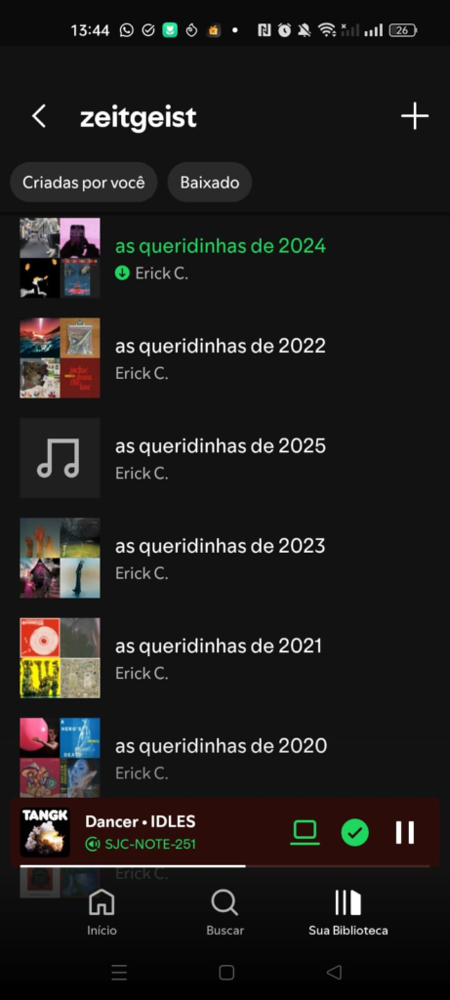
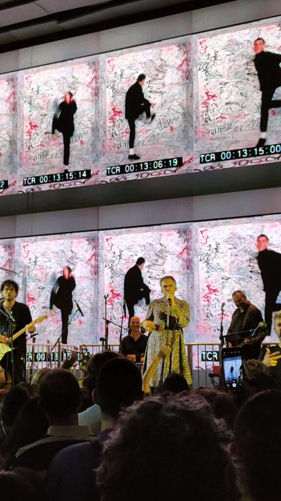
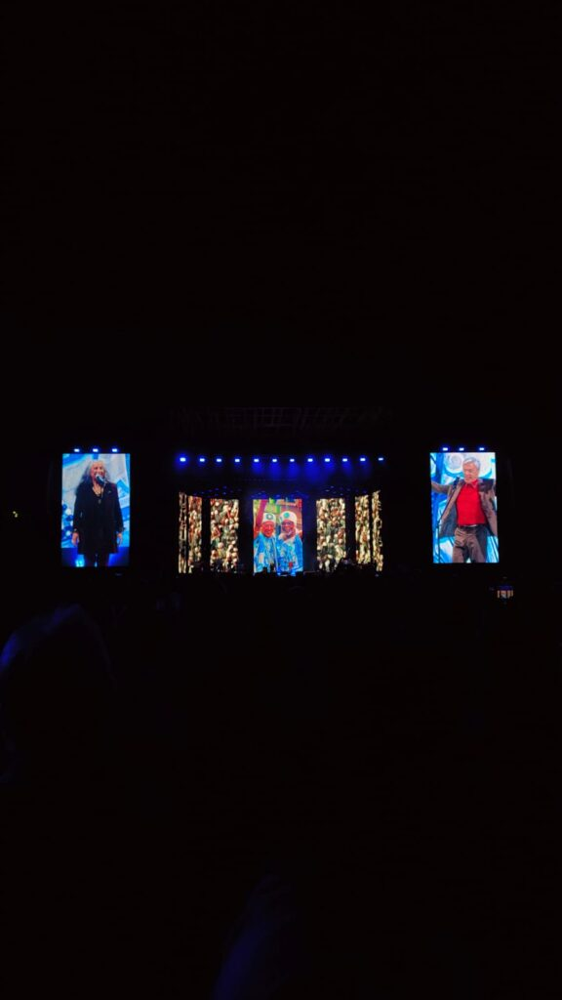
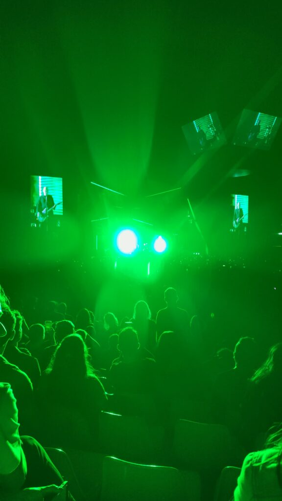
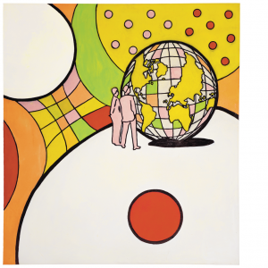
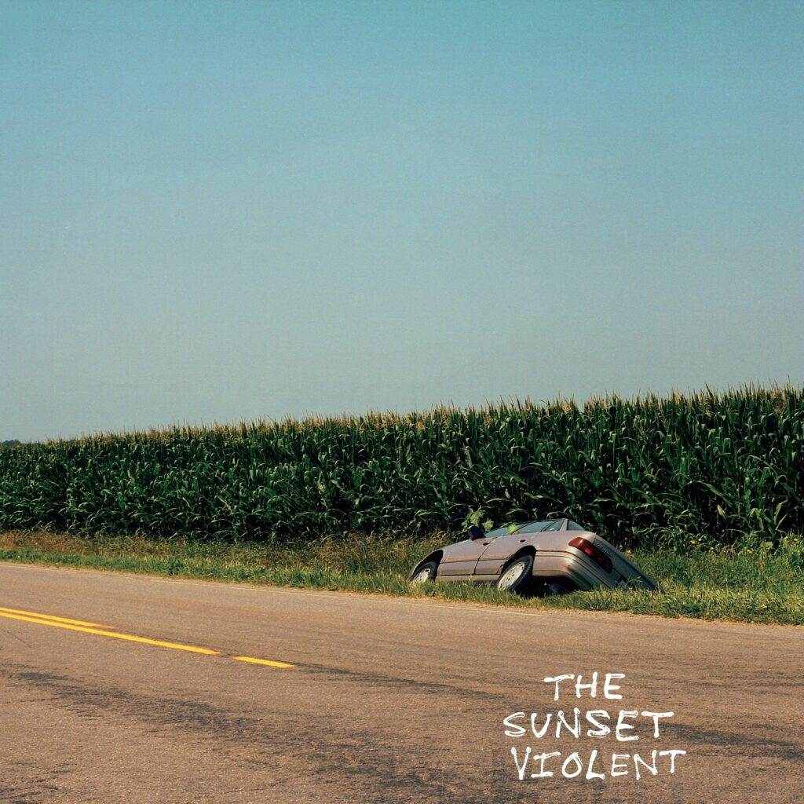

nota: comecei a escrever isso aqui num repente, em meados de dezembro. fiquei todo "omggg eu estou tão adiantado com a minha retrospectiva musical deste ano"!!!!

e aí viajei, perdi o fio da meada e nunca mais conseguir terminar de escrever esse texto e arrematar alguns detalhes. pra não ficar com isso aqui nos rascunho para sempre, decidi postar as it is. sim, em abril mesmo. é o melhor que pude fazer.

* * *

para ler ao som de:

eu tenho um costume - aliás, quando um _costume_ é promovido a _tradição_? - de fazer uma playlist com os 50 lançamentos musicais favoritos do ano que se encerra. uma música por artista, no máximo. faço isso desde pelo menos 2019.

é um exercício legal porque acaba me incentivando a procurar, mais ativamente, música atual e ainda sintetizar o que eu acho que tem de melhor no ano - que nem sempre é igual ao que eu de fato ouvi mais.

geralmente, eu concluo esse trabalho só nos primeiros dias de janeiro porque organização (bem como planejamento e também execução) não são o meu forte.

no entanto, em 2024, pela primeira vez, eu não consegui juntar 50 músicas para representar 2023. cavava, cavava mas eu simplesmente não tinha repertório.

uma das minhas teorias favorita para explicar isso é o algoritmo do spotify. por causa da comodidade das suas recomendações, ouvi pouca coisa de maneira _ativa_. junto com a Alexa, então, sem uma telinha para ir colocando as músicas na fila, a gente entra ainda mais fundo no modo ouvinte passivo, né? são sempre as mesmas 20 músicas ad infinitum.

mas acho que a explicação é (bem) mais profunda. 2023 também foi um ano de muitas novidades na vida.

pela primeira vez eu tinha uma carteira de motorista. alguns meses depois, comprei meu primeiro carro. estava quase (será?) me acostumando a ver a Pequena Pomerânia nome nada carinhoso para a cidade no cu do Espírito Santo, onde estava morando e que tem como língua co-oficial o Pomerano, junto com o Português. como casa. fiz uma viagem inusitada, apenas eu, meu pai e minha irmã, para Cuba. logo em seguida, me mudei de estado, pelo segundo ano consecutivo, e de uma hora para a outra. pela primeira vez, indo morar fora da região sudeste.

acabou que música foi algo secundário no meu 2023. por bons motivos, se for pensar bem. mesmo assim fiquei me sentindo mal com isso. música, desde a adolescência, é um elemento de construção de identidade para mim.

a essa altura, já com 31 anos nas costas, superei as barreiras de gênero e não me defino por uma tribo ou por gostar de determinada banda - já até tentei muito, quando mais novo, mas nunca consegui me sentir parte desses grupos. não sou indie, não sou roquero, nem nada disso. apenas… gosto de música. e gostar de descobrir músicas, ouvir novos artistas e explorar novos gêneros e subgêneros são parte indissociáveis do que me faz **eu**.

(um parênteses: esse assunto me lembrou o ótimo vídeo ensaio do Matheus Sodré, sobre o fim das tribos. vale assistir)

portanto, ter falhado nessa tarefa em 2023 me colocou em um estado de crise - “será que eu não sou mais uma pessoa música?” - e, por isso, comecei 2024 tentando ressignificar essa minha relação com a música.

descobri mais tarde que isso não passava por dar rewind e voltar com a relação que eu tinha com a música de 2022 para trás. pois a vida não é a mais a mesma, nem EU sou o mesmo.

afinal, se 2023 foi um ano de mudanças, 2024 foi de descobertas. já comecei o ano em Brasília e foi ao longo dele que eu me apossei de fato da cidade. conheci muita gente nova, descobri lugares diferentes, experimentei novos restaurantes, frequentei bares e baladinhas e fui a shows, muitos shows.

afinal de contas, essa é a minha primeira vez morando em uma capital, então, pela primeira vez na vida ir a um show não é mais algo reservado somente para artistas que eu queria MUITO ver; e nem caro ou que precisava ser planejado com muitos meses de antecedência. só agora pude ter a experiência de ir a um show e simplesmente voltar para casa e dormir como se **nada** tivesse acontecido.

fui a concertos de artistas que eu amo, de bandas que eu não conhecia e até de gente que eu achei que gostava mais do que realmente gosto.

  

desbravei a vida noturna da capital federal. fui a festinhas indies, góticas, sadomasoquistas e sambas. casas que tem sua tribo e casas em que todos estão lá só pelo fervo. de DJ pendrive a crate diggers.

e, logo eu, que desenvolvi minha relação com a música com a mediação de um computador, cria do eMule, 4shared e [last.fm](<http://last.fm>), reacendi essa chama através da música ao vivo, olho no olho, no mosh e em meio a suor e poeira.

e também tive menos reuniões, isso foi muito importante para ouvir mais música em horário comercial. 

o resultado foi um ano musicalmente muito bom. i mean, para a minha relação com música e acho que para a música como forma de arte também, a julgar pelos lançamentos dos artistas que acompanho ou que descobri em 2024.

e o que era pra ser um texto pra compartilhar minha playlist de melhores músicas e álbuns do ano ganhou vida própria e se tornou algo totalmente diferente. que eu não sei como dar sequência, inclusive. 

então vamos passar por alguns números, antes de chegarmos aos melhores do ano:

**20.020**  
foi o número de scrobbles registrados no [last.fm](<http://last.fm>) \- meu recorde em mais de 15 anos de conta!

**10.833**  
músicas diferentes. ou seja, ouvi cada música apenas 2 vezes, em média.

**119**  
plays em “Me Chama de Gato Eu Sou Sua”, uma a mais que o 2º álbum, JapanPopShow do Curumin

**3.344**  
artistas diferentes, 33% deles novos!

**22**  
shows, pelo menos (e olha que eu não fui em nenhum festivalzão onde vc vê 5 shows por dia)

**infinu**  
foi a casa de shows mais frequentada por moi em 2024, com xx apresentações)

e agora vamos para o momento mais aguardado e esperado (ler na voz do faustão) os… melhorees… doo anoooo:

## repescagem

Não saiu do repeat, mas não é de 2024:

  * Mistério Stereo - Curumin
  * Pais Nublado - Helado Negro
  * Depois de ti - Tozé Brito (de) novo
  * Strange Overtones - David Byrne
  * Carne - Walfredo em Busca da Simbiose

## passou batido

menções honrosas para 2 álbuns que me tocaram, mas não vi terem tanto destaque quanto acho que mereciam.

### personal trainer - still willing

não conhecia essa banda até ter minha atenção capturada pela música personal trainer - personal trainer, cujo refrão é "you can be my personal trainer".

poderia facilmente passar por um álbum da turma do brixton mill, no sul de londres, mas são dos países baixos. 

esse é o segundo álbum da banda, que tem um único membro permanente, o que me deixa muito ansioso para ver os trabalhos mais maduros, pois nesses dois já mostraram uma flexibilidade e criatividade invejáveis.

um equilíbrio delicioso entre melodias, hard rock e synths. pesado e divertido. **para quem gosta de:** Weezer, The Beta Band, Viagra Boys, Squid e Black Country, New Road.

### The Sunset Violent - Mount Kimbie

mais uma pedrada do Mount Kimbie e graças aos céus reprisando a parceria com o King Krule, que já havia nos presenteado, em 2019, com [Blue Train Lines](<https://www.youtube.com/watch?v=J1kzMFnFSh0>) \- cujo clipe poderia ser chamado de _"Como Gravar um Clipe apenas com uma Passagem de Ônibus pra Biblioteca Local e Transformar isso numa Trip Antropológica"_.

é um pós-punk cru, de baterias minimalistas e guitarras viajadas, com uma pitada de krautrock, vindas de, quem diria, um duo com origem no dubstep e que se tornou uma das melhores coisas na música britânica nos últimos 5 anos, fácil.

**para quem gosta de:** James Blake, Cindy Lee, Crumb, Caribou, ou LCD Soundsystem.

## performance do ano

não tem como ser outra, né? demorou só 3 anos, mas alguém finalmente desbancou a Dua Lipa e seu Tiny Desk Concert pandêmico.

https://www.youtube.com/watch?v=9kqnsoY94L8 

## composição do ano

eu não sou uma pessoa que liga muito para letra. para mim, melodia é tudo, a letra é só um extra que acrescenta uma camada secundária, mais literal, de interpretação. enfim, tema para outro texto.

apesar disso, holy holy do geordie greep, para além da melodia incrível, tem uma letra que poderia ser um ótimo conto. com direito a plot twist e tudo. por favor, leiam o [genius ](<https://genius.com/Geordie-greep-holy-holy-lyrics>)e se obcequem por ela comigo!

https://www.youtube.com/watch?v=A4EU_0vFzuU 

## top 10 álbuns do ano

inicialmente, a ideia era escolher 5 e falar um pouco sobre cada, mas vamos ficar com os 10 finalistas mesmo.

  1. Prelude to Ecstasy - The Last Dinner Party
  2. Baño María - Ca7riel * Paco Amoroso
  3. The New Sound - Geordie Greep
  4. Still Willing - Personal Trainer
  5. Brat - Charlie XCX
  6. Y’Y - Amaro Freitas
  7. Starbuster - Fontaines D.C.
  8. Broken Man - St. Vincent
  9. Reaching Out - Beth Gibbons
  10. Only God Was Above Us - Vampire Weekend
  11. Dora Morelenbaum

## top 5 músicas

minha 5 músicas favoritas de 2024

  * Guess - Charli XCX feat. Billie Eilish
  * All your children - Jamie XX
  * Image - Magdalena bay
  * Dores laborais - Éme
  * Caco - Dora Mrelenbaum